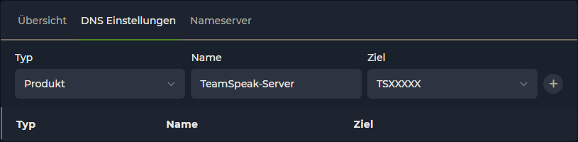
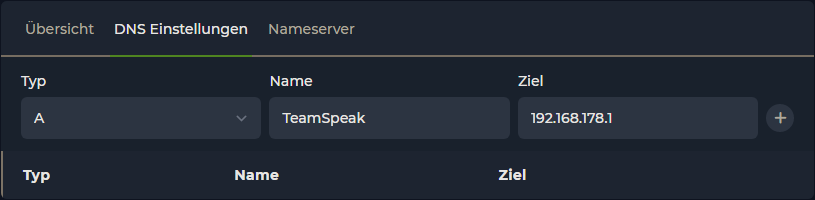
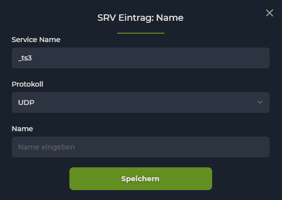
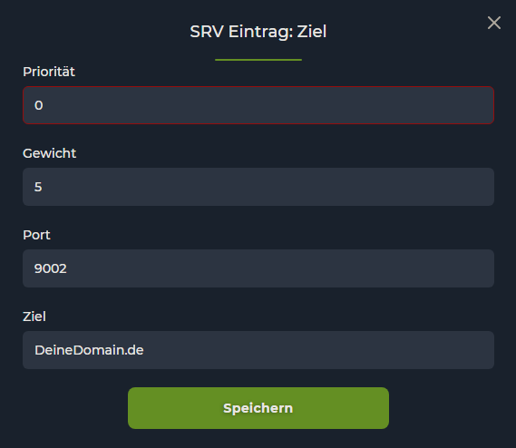
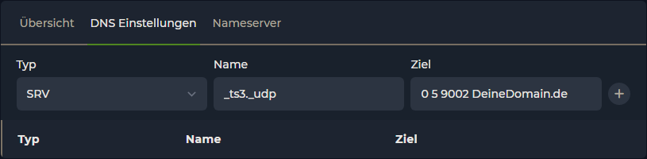

# TeamSpeak Server

To forward your domain to a Minecraft server, click on "**DNS settings**" in your domain.

If the TeamSpeak is on the same account as the domain, you can select **PRODUCT** under "Type", give the forwarding a name and select the appropriate TeamSpeak server under "Destination".

<figure><figcaption>
TeamSpeak at EmeraldHost
</figcaption></figure>

If you host your TeamSpeak server yourself or with another hosting, you must create the following entries &#x20;

## A-Record

Select the **A-Record** under "Type".

Give the forwarding a name by which you can recognize the TeamSpeak forwarding.

The "Destination" is the IP address of your TeamSpeak server without port.

<figure><figcaption>
A Record
</figcaption></figure>

## SRV Record

Select the **SRV Record** under "Type".

Now click on the empty field under "Name" &#x20;

Now enter the following data in the opened window:

* Service Name -> \_ts3
* Protocol -> UDP
* Name -> Can be left empty unless you want to connect with e.g. "ts." in front of your domain

Confirm the entries with "Save".

<figure><figcaption>
SRV Record "Name"
</figcaption></figure>

Now click on the empty field under "Target" &#x20;

Now enter the following data in the opened window:

* Priority -> 0
* Weight -> 5
* Port -> The port of your TeamSpeak server
* Destination -> Your domain | If you have just entered something under "Name", this must be preceded by a ".".

Now confirm your entries with "Save".

<figure><figcaption>
SRV Record "Destination"
</figcaption></figure>

<figure><figcaption>
Create SRV Record
</figcaption></figure>
