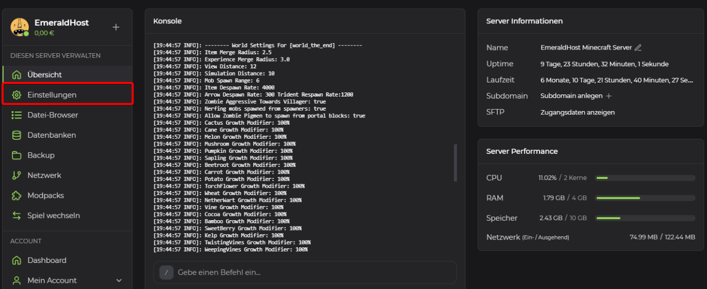
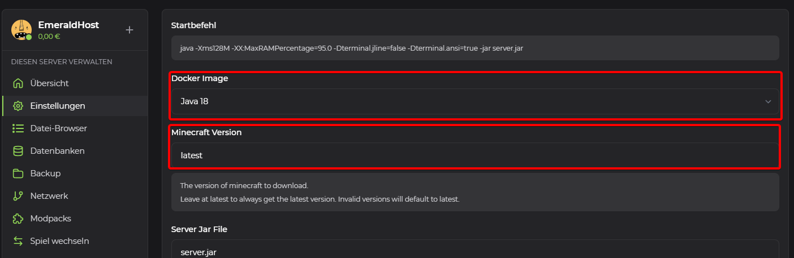
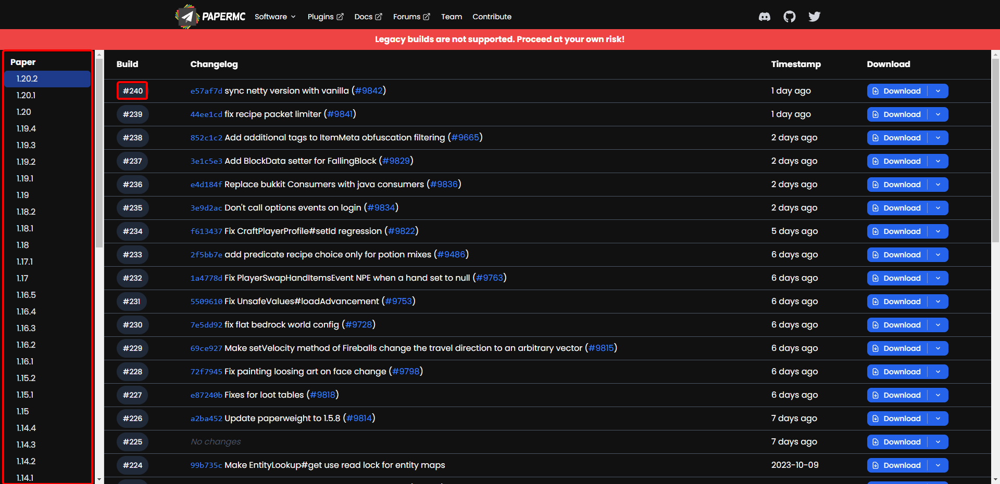
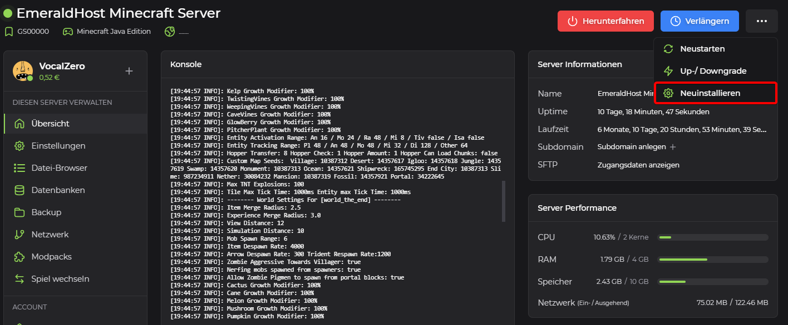
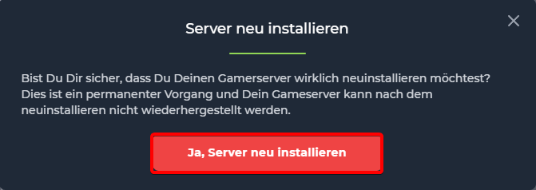

# Change version on a Minecraft server

## Version

In Minecraft, a "version" refers to a specific variant or edition of the game. Minecraft has released various versions over the years, which have brought changes to the gameplay as well as to the game mechanics, graphics and functions.

## Change version on a Minecraft server:

1. <b>Open server administration</b> 
    To select a version, please visit the administration page of your Minecraft server on EmeraldHost.

2. <b>Find the server settings</b> 
    Navigate to the "Settings" tab in the right sidebar and select it.

    

3. <b>Select new version</b> 
    

    You can now enter the desired Minecraft version under "Minecraft version". The version should correspond to the official Minecraft versioning.

    Example: `1.20` or `1.19` or `1.18` or `1.17` or `1.16`, ...

    Depending on the Minecraft version selected, a different Java version should be selected for the "Docker Image". Here is a list of Minecraft versions and the corresponding Docker images:
    | Minecraft Version | Docker Image |
    | -------------------------- | ------------------ |
    | 1.17 and higher | Java 16 or higher |
    | 1.16.x (Nether Update) | Java 11 or higher |
    | 1.15.x (Buzzy Bees) | Java 8 or higher |
    | 1.14.x (Village & Pillage) | Java 8 or higher |
    | 1.13.x | Java 8 or higher |
    | 1.12.x | Java 8 |
    | 1.11.x and older | Java 8 |

    Furthermore, the "Build Number" must be specified to match the Minecraft version previously entered. We install PaperSpigot on all Minecraft servers by default. If the server software has been changed, the corresponding build number should be determined from the website of the respective server software.

    Here you can find all Minecraft versions and corresponding build numbers of PaperSpigot: https://papermc.io/downloads/all

    
    
    You can select the desired Minecraft version on the left-hand side, and for each version you will find all the corresponding builds in the middle. For EmeraldHost you have to enter the build number without the "#".

    Here is a list of build numbers that correspond to the respective Minecraft versions:
    | Minecraft Version | Paper Build |
    | ----------------- | ----------- |
    | 1.20 | 17 |
    | 1.19 | 81 |
    | 1.18 | 66 |
    | 1.17 | 79 |
    | 1.16.1 | 138 |
    | 1.15 | 21 |
    | 1.14 | 17 |
    | 1.13 | 173 |
    | 1.12 | 1169 |
    | 1.11.2 | 1106 |
    | 1.10.2 | 918 |
    | 1.8.8 | 445 |

4. <b>Reinstall server</b> 
    Return to the overview page of your Minecraft server. Click on the three dots at the top right and select "Reinstall". Your Minecraft server will be reset once and reinstalled with the Minecraft version you selected.

    

    A new window will open in which you must confirm the new installation. Confirm this process by clicking on "Yes, reinstall server".

    

    The completion of the process will be displayed as soon as your Minecraft server is online again.

### That's it! With these steps you should be able to install another version for your Minecraft server.
