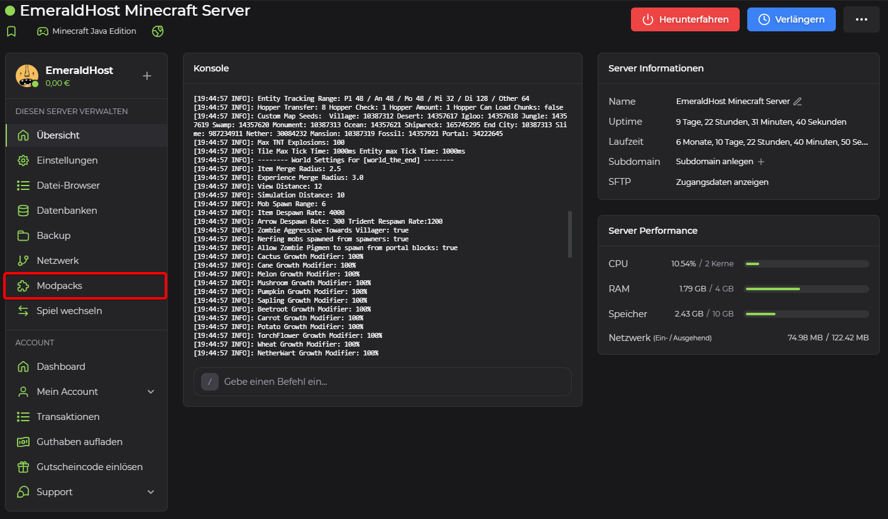
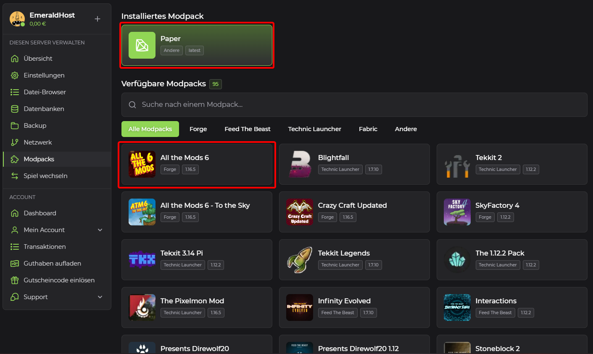
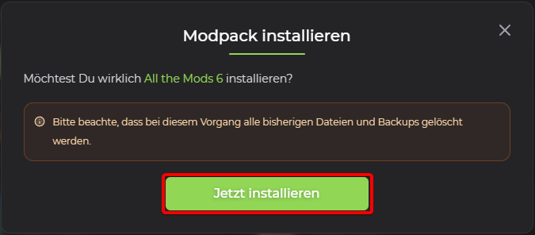

# Modpack bei einem Minecraft Server ändern

## Modpacks

Modpacks in Minecraft sind Sammlungen von Mods, Texturenpaketen und Konfigurationseinstellungen, die von der Minecraft-Community oder Moddern erstellt werden. Diese Modifikationen und Anpassungen ändern oder erweitern das Gameplay, die Grafik, die Spielmechanik und mehr. Modpacks werden in der Regel so zusammengestellt, dass sie gut miteinander funktionieren und ein kohärentes Spielerlebnis bieten.

## Bereitgestelltes Modpack von EmeraldHost auswählen:

1. <b>Serververwaltung öffnen</b> 
    Um ein Modpack auszuwählen, besuche bitte die Verwaltungsseite deines Minecraft-Servers auf EmeraldHost.

2. <b>Finde die Modpack-Einstellungen</b> 
    Navigiere in der rechten Seitenleiste zum Reiter "Modpacks" und wähle diesen aus.

    

3. <b>Neues Modpack auswählen</b> 
    Oberhalb des Abschnitts "Installiertes Modpack" findest du Informationen zu deinem aktuellen Modpack, das auf deinem Minecraft-Server installiert ist.
    
    Unter "Verfügbare Modpacks" hast du eine breite Auswahl an Modpacks, die du unkompliziert auf deinen Minecraft-Server installieren kannst. Für unser Beispiel verwenden wir das Modpack "All the Mods 6".
    
    Klicke auf das gewünschte Modpack, das du installieren möchtest.

    

4. <b>Bestätige die Installation</b> 
    In einem neuen Fenster wirst du darauf hingewiesen, dass bei diesem Vorgang alle vorhandenen Dateien und Backups gelöscht werden. Bestätige diese Meldung, indem du auf "Jetzt installieren" klickst. Dein Minecraft-Server wird zurückgesetzt und das ausgewählte Modpack wird neu installiert. Die Fertigstellung des Vorgangs wird angezeigt, sobald dein Minecraft-Server wieder online ist.

    

    :::warning
    Bitte beachte, dass bei diesem Vorgang alle bisherigen Dateien und Backups gelöscht werden.
    :::
    :::info
    Fehlt ein Modpack, kannst du gerne die Empfehlung für dieses Modpack in unserem [Community-Discord-Server](https://discord.com/invite/Gw38Ve3Nqr) abgeben.
    :::

### Das war's! Mit diesen Schritten solltest Du in der Lage sein, ein Modpack für dein Minecraft Server zu installieren.