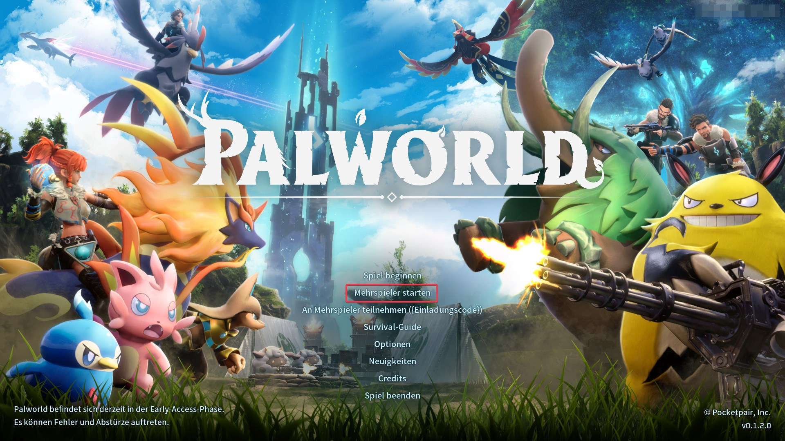
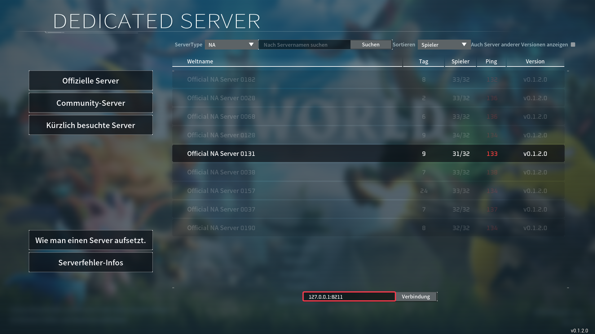

# Palworld Server beitreten

## Voraussetzungen

- Serveradresse inklusive Port
    - Diese findest Du in der Verwaltung Deines Gameservers, direkt untern Namen Deines Servers.

## Schritte

1. <b>Palworld starten</b>
   - Starte das Spiel Palworld.

2. <b>Mehrspieler-Modus auswählen</b>
   - Wähle im Hauptmenü die Option "Mehrspieler starten".
   

3. <b>Serveradresse eingeben</b>
   - Gebe Deine Serveradresse ein, zu dem Du Dich verbinden möchtest, in das vorgesehene Eingabefeld für die Direktverbindung ein.
   

4. <b>Verbindung herstellen</b>
   - Klicke auf "Verbinden", um Dich mit dem Server zu verbinden.
   

### Mit diesen Schritten solltest Du Dich erfolgreich auf Deinen Palworld-Server verbunden haben. Jetzt kannst Du das Abenteuer in der faszinierenden Welt von Palworld mit Freunden oder anderen Spielern genießen
