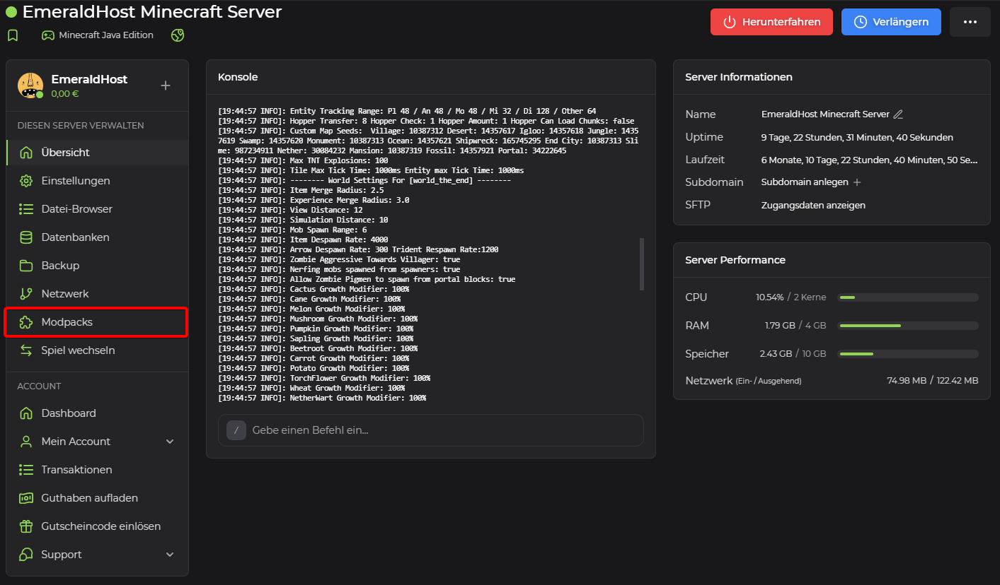
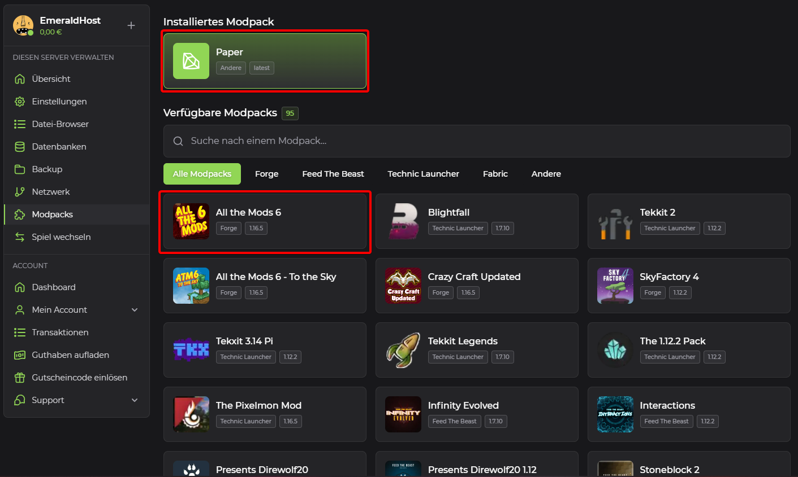
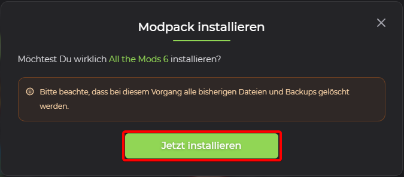

## Modpacks

Modpacks in Minecraft are collections of mods, texture packs and configuration settings created by the Minecraft community or modders. These modifications and customizations change or enhance gameplay, graphics, game mechanics and more. Modpacks are usually put together in such a way that they work well together and offer a coherent gaming experience.

## Select the modpack provided by EmeraldHost

1. **Open server administration**\
    To select a modpack, please visit the administration page of your Minecraft server on EmeraldHost.

2. **Find the modpack settings**\
    Navigate to the "Modpacks" tab in the right sidebar and select it.

    

3. **Select new modpack**\
    Above the section "Installed modpack" you will find information about your current modpack installed on your Minecraft server.

    Under "Available modpacks" you have a wide selection of modpacks that you can easily install on your Minecraft server. For our example, we are using the modpack "All the Mods 6".

    Click on the modpack you want to install.

    

4. **Confirm the installation**\
    In a new window, you will be informed that all existing files and backups will be deleted during this process. Confirm this message by clicking on "Install now". Your Minecraft server will be reset and the selected modpack will be reinstalled. The completion of the process will be displayed as soon as your Minecraft server is back online.

    

    > [!WARNING]
    > Please note that all previous files and backups will be deleted during this process.

    > [!NOTE]
    > If a modpack is missing, you are welcome to submit a recommendation for this modpack in our [Community Discord Server](https://discord.emeraldhost.de/).
